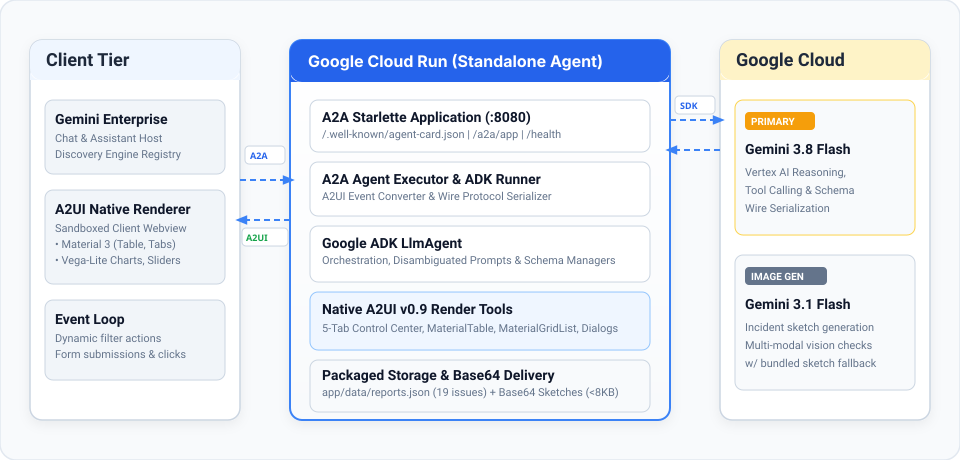

# A2UI v0.9 ADK Reference Agent: Operations Control Center

[](https://a2ui.org)
[](https://github.com/google/adk-python)
[](https://cloud.google.com/vertex-ai)
[](https://cloud.google.com/run)

A standalone reference implementation of an **Agent-to-User Interface (A2UI v0.9)** enterprise agent built with the **Google Agent Development Kit (ADK)** and serving over the **Agent-to-Agent (A2A)** protocol.

Designed to showcase rich, responsive, native client-rendered surfaces on **Google Gemini Enterprise** and modern A2A clients **without external cloud storage dependencies**.

📄 **One-pager:** [yonitg.github.io/ge-agent-a2ui](https://yonitg.github.io/ge-agent-a2ui/) (architecture, design choices and code map on one page).

---

## 🌟 Key Features

* **Pure Native A2UI v0.9 Protocol**:
  Uses standard wire protocol messages (`createSurface`, `updateComponents`, and `updateDataModel`) referencing the official composite catalog (`https://www.gstatic.com/vertexaisearch/a2ui/v0_9/gemini_enterprise_composite_catalog.json`).
* **5-Tab Operations & Incidents Control Center**:
  * **Tab 0 (Overview & Dispatch)**: Real-time KPI gauges, 24h SLA compliance progress bars, emergency slide toggle, and quick-dispatch actions.
  * **Tab 1 (Incidents Directory)**: Pure native **`MaterialTable`** with sortable columns and dynamic category filter chips (HVAC, Electrical, Plumbing, Furniture, Safety).
  * **Tab 2 (Visual Sketch Gallery)**: Responsive native **`MaterialGridList`** rendering the 9 most recent inspection sketches, newest first.
  * **Tab 3 (Analytics & SLA Forecasting)**: Dynamic Vega-Lite analytics chart (**`VegaChart`**) with live data model binding (`updateDataModel`), paired with an interactive **`MaterialSlider`** threshold simulation.
  * **Tab 4 (Dispatch & Service Form)**: Comprehensive Material 3 input suite (`MaterialSelect`, `MaterialInput`, `MaterialRadioButton`, `MaterialCheckbox`, `MaterialDatepicker`, `MaterialTimepicker`, `MaterialChips`).
* **Interactive Dialogs & Context Menus**:
  A **`MaterialDialog`** that opens in the browser from its trigger button and a **`MaterialMenu`** of ticket actions. Their choices go to the agent, which answers with an `updateDataModel` for the same card: the dialog closes and the card shows the result.
* **Self-Contained Cloud Run Architecture**:
  * Bundled incident seed database (`app/data/reports.json`).
  * 19 pre-packaged inspection sketches, the welcome banner and the agent icon all ship inside the container and are delivered as compressed **Base64 Data URIs**.
  * No GCS bucket, CDN or other public image hosting is needed, so there is no CORS setup and no public access prevention org policy blockers.
* **Private by Default**:
  The Cloud Run service requires IAM authentication. Gemini Enterprise calls it with its own service identity, so the agent is never exposed to the public internet.
* **Vertex AI Powered**:
  Utilizes **Gemini 3.8 Flash** for agent reasoning and tool orchestration, with graceful fallback to bundled sketches if image generation quota is unavailable.

---

## 🎨 What is A2UI?

**A2UI (Agent-to-User Interface)** is an open industry standard protocol ([a2ui.org](https://a2ui.org)) designed to give autonomous AI agents the ability to dynamically render rich, interactive, and secure user interfaces inside chat clients—moving far beyond plain text and static Markdown.

### Key Concepts

* **Declarative JSON Protocol**:
  Instead of sending raw HTML, CSS, or executable JavaScript, the agent delivers a strictly validated JSON payload. The host application renders these components natively using its own client-side design system.
* **The A2UI v0.9 Wire Format**:
  A standard A2UI interaction comprises three distinct, atomic message types:
  1. `createSurface`: Instantiates an isolated surface container bound to an official component catalog (e.g., `gemini_enterprise_composite_catalog.json`).
  2. `updateComponents`: Emits a flat list of uniquely-identified components (`MaterialTable`, `MaterialTabs`, `MaterialGridList`, `MaterialCard`, `MaterialButton`, `MaterialSlider`, etc.).
  3. `updateDataModel`: Dynamically injects or mutates reactive data models (e.g., datasets for `VegaChart` visualizations or form field states).
* **Two-Way Interactive Event Loop**:
  Surfaces are not passive receipts. Buttons, category filter chips, slider thresholds, and form inputs trigger structured client-to-agent actions that are processed by the agent without triggering full-page reloads.

### How Google Gemini Enterprise Supports A2UI

Google **Gemini Enterprise** incorporates a native client-side A2UI rendering engine:
1. When Gemini Enterprise initiates an A2A conversation with this agent, it inspects the agent's card and detects the `https://a2ui.org/a2a-extension/a2ui/v0.9` capability.
2. When the agent emits an A2UI payload, Gemini Enterprise parses the declarative JSON and renders Google Material Design 3 components directly in the user's conversational stream.
3. The interface runs in a sandboxed, secure client webview with zero risk of Cross-Site Scripting (XSS), cross-origin leakage, or unauthorized DOM access.

### Official A2UI Documentation & Specifications

* **Official Website**: [https://a2ui.org](https://a2ui.org)
* **A2UI v0.9 Specification**: [https://a2ui.org/specification/v0.9-a2ui/](https://a2ui.org/specification/v0.9-a2ui/)
* **Component Catalogs**: [https://a2ui.org/concepts/catalogs/](https://a2ui.org/concepts/catalogs/)
* **Composite Catalog Definition**: [`gemini_enterprise_composite_catalog.json`](https://www.gstatic.com/vertexaisearch/a2ui/v0_9/gemini_enterprise_composite_catalog.json)
* **Google Agent Development Kit (ADK)**: [https://github.com/google/adk-python](https://github.com/google/adk-python)

---

## 📐 Architecture

<p align="center">
  
</p>

The agent runs as a containerized Starlette/A2A service on Google Cloud Run. Incoming user utterances from Gemini Enterprise or any A2A-compliant client trigger tool calls executed by the Google ADK runner. When maintenance dashboards or reports are requested, the agent constructs native A2UI v0.9 declarative JSON payloads delivered back over A2A and rendered natively in the user's browser.

---

## 🚀 Quickstart (Local Development)

### Prerequisites
1. **Python 3.12+** and [uv](https://docs.astral.sh/uv/) installed.
2. Google Cloud SDK (`gcloud`) installed and authenticated:
   ```bash
   gcloud auth login
   gcloud auth application-default login
   ```

### 1. Clone and Install
```bash
git clone https://github.com/yonitg/ge-agent-a2ui.git
cd ge-agent-a2ui
make install
```

### 2. Configure Environment
Copy the example environment file:
```bash
cp .env.example .env
```
Edit `.env` and set your Google Cloud project:
```ini
GOOGLE_CLOUD_PROJECT=your-gcp-project-id
GOOGLE_CLOUD_LOCATION=global
MODEL=gemini-3.8-flash
PORT=8080
```

### 3. Run Unit Tests
```bash
make test
# or: uv run pytest tests/unit -v
```

### 4. Start Local Server
```bash
make run
# or: uv run uvicorn app.main:app --host 0.0.0.0 --port 8080 --reload
```
The server will start at `http://127.0.0.1:8080`.

Verify health and agent metadata:
```bash
curl http://127.0.0.1:8080/health
curl http://127.0.0.1:8080/.well-known/agent-card.json
```

---

## ☁️ One-Click Cloud Run Deployment

Deploy the entire agent to **Google Cloud Run** using the automated deployment script (works from any working directory and in Cloud Shell):

```bash
./deploy.sh <YOUR_PROJECT_ID> [SERVICE_NAME] [REGION] [MODEL_NAME]
```

Example:
```bash
./deploy.sh my-gcp-project a2ui-adk-agent us-central1 gemini-3.8-flash
```

To also register the agent in your Gemini Enterprise app automatically, set these before running the script:
```bash
export GEMINI_ENTERPRISE_ENGINE_ID=<your-gemini-enterprise-app-id>
export GEMINI_ENTERPRISE_LOCATION=global   # or "eu" / "us", matching your app's location
./deploy.sh my-gcp-project
```

The script runs preflight checks (`gcloud` login, project access, and `python3` when registering) and then automatically:
1. Enables required APIs (`run.googleapis.com`, `cloudbuild.googleapis.com`, `artifactregistry.googleapis.com`, `aiplatform.googleapis.com`, `iam.googleapis.com`).
2. Creates a dedicated least-privilege runtime service account (`a2ui-agent-runtime@<PROJECT_ID>.iam.gserviceaccount.com`) if needed and grants it only `roles/aiplatform.user`.
3. Builds and deploys the container from source as a **private** Cloud Run service (`--no-allow-unauthenticated`, `--service-account`, max 1 instance), preserving `AGENT_URL` across redeploys so a redeploy creates a single revision.
4. Sets `AGENT_URL` on first deploy and grants the Gemini Enterprise service agent (`service-<PROJECT_NUMBER>@gcp-sa-discoveryengine.iam.gserviceaccount.com`) the Cloud Run Invoker role (`roles/run.invoker`) on the service.
5. Smoke-tests `/health` and `/.well-known/agent-card.json` against the deployed service.
6. Registers or updates the agent in Gemini Enterprise (when `GEMINI_ENTERPRISE_ENGINE_ID` is set; otherwise prints the manual command).

Optional settings (environment variables):

| Variable | Default | Purpose |
| :--- | :--- | :--- |
| `GEMINI_ENTERPRISE_ENGINE_ID` | *(unset)* | Gemini Enterprise app ID to register the agent in. |
| `GEMINI_ENTERPRISE_LOCATION` | `global` | Location of the Gemini Enterprise app (`global`, `eu` or `us`). |
| `GEMINI_ENTERPRISE_PROJECT_ID` | deploy project | Project that hosts the Gemini Enterprise app, if different. |
| `GEMINI_ENTERPRISE_DISPLAY_NAME` | `A2UI 0.9 ADK Agent` | Agent display name in Gemini Enterprise. |
| `RUNTIME_SERVICE_ACCOUNT` | `a2ui-agent-runtime` | Service account ID (created in the deploy project if missing) or full email of an existing service account to run the service as. |
| `MAX_INSTANCES` | `1` | Cloud Run max instances. Sessions and reports are kept in memory, so one instance keeps the demo consistent and caps Vertex AI spend. |
| `ALLOW_UNAUTHENTICATED` | `false` | Set to `true` only for a throwaway public demo. |

### Calling the private service

The service only accepts requests with a Google ID token from a principal that has the `run.routes.invoke` permission on it (Cloud Run Invoker or Admin, or a project Owner or Editor). Gemini Enterprise gets it through step 4. To call it yourself:
```bash
SERVICE_URL=https://<YOUR_SERVICE_URL>
curl -s -H "Authorization: Bearer $(gcloud auth print-identity-token)" "$SERVICE_URL/health"
curl -s -H "Authorization: Bearer $(gcloud auth print-identity-token)" "$SERVICE_URL/.well-known/agent-card.json"
```

---

## 🤖 Registering the Agent in Google Gemini Enterprise

The primary destination for this agent is registration within **Google Gemini Enterprise** (formerly Vertex AI Search & Conversation / Discovery Engine) so enterprise users can seamlessly interact with the Operations Control Center directly from their chat stream.

### Does this agent have an A2A Agent Card?

**Yes.** Built upon the open **A2A (Agent-to-Agent)** standard and Google ADK, this agent automatically generates, serves, and validates standard A2A Agent Cards at:
* **Official A2A Endpoint**: `https://<YOUR_SERVICE_URL>/.well-known/agent-card.json`
* **Legacy Compatibility Endpoint**: `https://<YOUR_SERVICE_URL>/.well-known/agent.json`

The card advertises:
* **Agent Metadata**: `"A2UI 0.9 Operations Control Center"` with full streaming support (`capabilities.streaming = true`).
* **A2UI Extension**: Declares extension `https://a2ui.org/a2a-extension/a2ui/v0.9` and binds to the official composite catalog (`https://www.gstatic.com/vertexaisearch/a2ui/v0_9/gemini_enterprise_composite_catalog.json`).
* **Published Skills**: `file_report` (incident reporting with sketch) and `manage_operations` (5-tab interactive operations dashboard).

---

### Step-by-Step Registration Guide

#### Step 1: Deploy and Obtain Service URL
Deploy your Cloud Run service via `./deploy.sh` and copy the assigned HTTPS service URL:
```bash
./deploy.sh <YOUR_PROJECT_ID> a2ui-adk-agent us-central1 gemini-3.8-flash
```
*Example Service URL*: `https://a2ui-adk-agent-xyz-uc.a.run.app`

#### Step 2: Register the Agent
**Option A (recommended): let the script do it.** Set `GEMINI_ENTERPRISE_ENGINE_ID` (and `GEMINI_ENTERPRISE_LOCATION`) before running `./deploy.sh`, or run the registration script on its own:
```bash
python3 register_gemini_enterprise.py --project <YOUR_PROJECT_ID> \
    --service-url https://<YOUR_SERVICE_URL> --engine <YOUR_APP_ID> --location <global|eu|us>
```
It reads the agent card from the private service with your gcloud identity and registers it with the bundled agent icon. Re-running it updates the existing registration; `--delete` removes it.

**Option B: Google Cloud console.**
1. Fetch the agent card JSON (the service is private, so pass an ID token):
   ```bash
   curl -s -H "Authorization: Bearer $(gcloud auth print-identity-token)" \
       https://<YOUR_SERVICE_URL>/.well-known/agent-card.json
   ```
2. In the Google Cloud console, open **Gemini Enterprise** and click the name of your app.
3. Click **Agents** > **Add Agents**, then **Add** for **Custom agent via A2A**.
4. Paste the agent card JSON into the **Agent card JSON** field and finish the wizard.

#### Step 3: Confirm the IAM Invoker Role
Gemini Enterprise calls the private service as its Discovery Engine service agent, which needs the Cloud Run Invoker role on the service. `deploy.sh` grants it automatically. If you deployed differently, or your Gemini Enterprise app lives in another project, grant it with that project's number:
```bash
# 1. Retrieve the project number of the project that hosts your Gemini Enterprise app
PROJECT_NUMBER=$(gcloud projects describe <GEMINI_ENTERPRISE_PROJECT_ID> --format='value(projectNumber)')

# 2. Authorize Discovery Engine to call your Cloud Run service
gcloud run services add-iam-policy-binding a2ui-adk-agent \
    --project="<YOUR_PROJECT_ID>" \
    --region="us-central1" \
    --member="serviceAccount:service-${PROJECT_NUMBER}@gcp-sa-discoveryengine.iam.gserviceaccount.com" \
    --role="roles/run.invoker"
```
Gemini Enterprise attaches an ID token for this service agent only when the agent URL is the service's default `*.run.app` URL (not a custom domain).

#### Step 4: Test the Integration in Gemini Enterprise Chat
Open the Gemini Enterprise chat interface in your browser and try the following prompts:
* *"Show me the operations control center"*
* *"List active building incidents"*
* *"Show the visual sketch gallery"*
* *"Report a broken chair in the Yellow Room"*

Gemini Enterprise will invoke the agent via A2A, receive the declarative A2UI payload, and natively render the interactive **MaterialTable**, **MaterialGridList**, and **VegaChart** surfaces directly inside the chat conversation!

---

## 🔒 Security Notes

This is a demo. Before you adapt it:
* **Keep the service private.** `deploy.sh` deploys with `--no-allow-unauthenticated`; only principals with Cloud Run Invoker on the service (you and the Gemini Enterprise service agent) can call it. `ALLOW_UNAUTHENTICATED=true` exposes the agent, its Vertex AI usage and the reports to anyone who finds the URL.
* **Dedicated runtime service account.** `deploy.sh` runs the service as `a2ui-agent-runtime@<PROJECT_ID>.iam.gserviceaccount.com` with only `roles/aiplatform.user`, rather than the default Compute Engine service account.
* **In-app token check is for non-Cloud Run hosting only.** `ENFORCE_IAM_AUTH` / `ALLOWED_SERVICE_ACCOUNTS` verify `Authorization: Bearer` ID tokens minted for `AGENT_URL`. On Cloud Run, Gemini Enterprise sends its token in `X-Serverless-Authorization`, which Cloud Run IAM consumes, so leave these unset there. A rejected token is logged with the reason, never the token itself.
* **Registration script.** `register_gemini_enterprise.py` sends requests only over HTTPS and never follows redirects. Your ID token goes only to the `*.run.app` service, and your access token only to the Discovery Engine API; `--location` must be a plain location ID such as `eu`.
* **Demo storage.** Reports live in `/tmp/reports.json` and generated sketches in memory. They are shared by all users of the instance and reset when it restarts. Use a real database with per-user access control for anything beyond a demo.
* **Unprivileged container.** The image runs as UID 10001, not root. The code and its virtualenv are read-only to that user; the app only writes to `/tmp`.
* **Cost controls.** Every new report calls the Vertex AI image model. The service is capped at `MAX_INSTANCES` (default 1), free-text fields are length-limited, and identical submissions within two minutes are deduplicated. Surfaces the user already has are replaced with a one-line note before each model call, so a long chat does not resend the inline images to Gemini. Set a [budget alert](https://cloud.google.com/billing/docs/how-to/budgets) on the project as well.
* **Treat report text as untrusted.** Anyone who can call the agent can file reports that other users then see. Rendered surfaces are not fed back to the model and the agent has no destructive tools, which limits what a prompt-injection attempt could do.

---

## 📁 Repository Structure

```
.
├── Dockerfile                               # Cloud Run container definition
├── Makefile                                 # Development tasks (install, run, test, deploy)
├── README.md                                # Documentation and architecture
├── LICENSE                                  # Apache License 2.0
├── .env.example                             # Template for local environment settings
├── deploy.sh                                # Automated Cloud Run deployment script
├── register_gemini_enterprise.py            # Registers the agent in a Gemini Enterprise app
├── pyproject.toml                           # Dependencies and project metadata
├── uv.lock                                  # Locked dependency tree
├── gemini_enterprise_composite_catalog.json # Official A2UI v0.9 composite catalog
├── docs/
│   ├── architecture.svg                     # Architecture diagram
│   └── index.html                           # One-pager (GitHub Pages)
├── app/
│   ├── agent.py                             # ADK LlmAgent definition, prompts, & tools
│   ├── agent_executor.py                    # A2A request handler & A2UI converter
│   ├── auth_middleware.py                   # Optional ID token check (non-Cloud Run hosting)
│   ├── config.py                            # Central environment configuration
│   ├── main.py                              # Starlette app & endpoints
│   ├── render_tools.py                      # Pure native A2UI v0.9 surface builders
│   ├── report_tools.py                      # Self-contained JSON CRUD & sketch generator
│   ├── session_keys.py                      # Session state management
│   ├── assets/
│   │   ├── agent_icon.png                   # Agent avatar
│   │   ├── welcome_header.png               # Banner thumbnail
│   │   └── issue_images/                    # 19 bundled maintenance sketches
│   ├── data/
│   │   └── reports.json                     # Seed incidents database
│   ├── catalog_schemas/                     # Schema definitions for A2UI catalogs
│   └── app_utils/                           # A2UI payload sanitization
└── tests/
    └── unit/                                # Comprehensive unit tests
```

---

## 🧪 Testing & Verification

Run the complete test suite:
```bash
uv run pytest tests/unit -v
```

Tests cover:
* **All 5 Control Center Tabs**: Validating message structures (`createSurface`, `updateComponents`, `updateDataModel`).
* **Native Component Validation**: Verifying that `MaterialTable`, `MaterialGridList`, `VegaChart`, and `MaterialSlider` are correctly structured.
* **Filter Integrity**: Ensuring category filter chips correctly slice table records.
* **Deduplication & Idempotency**: Testing one-shot report filing without duplicate submissions.
* **Form Binding & Input Limits**: The dispatch form files exactly what the user typed, and over-long fields are truncated.
* **Gallery**: The 9 most recent reports get a tile, newest first, and the dashboard message stays small enough for Gemini Enterprise to re-render a reopened chat.
* **Dialog & Menu**: The dialog starts closed (reopening a chat does not pop it up), and Confirm, Cancel and menu choices update the card they came from.
* **Prompt Size**: Surfaces already rendered to the user are not resent to the model.
* **Security & Middleware**: ID token checks (audience, allowed service accounts, generic 401 body, no token in the logs) and the registration script's icon, token and URL handling (HTTPS only, no redirects, fixed API host).

---

## ⚠️ Disclaimer

This code is provided "as-is" as a demonstration only to illustrate a potential solution. The code does not constitute a Google product or service of any kind, and Google offers no support, warranties, or liability of any kind with its regard. Whoever chooses to use this code accepts all responsibility related to it, including for its implementation, use, and ongoing maintenance. For the avoidance of doubt, this code is not eligible for the Google Open Source Software Vulnerability Rewards Program.

---

## 📄 License

Apache 2.0 - See [LICENSE](LICENSE) for details.
